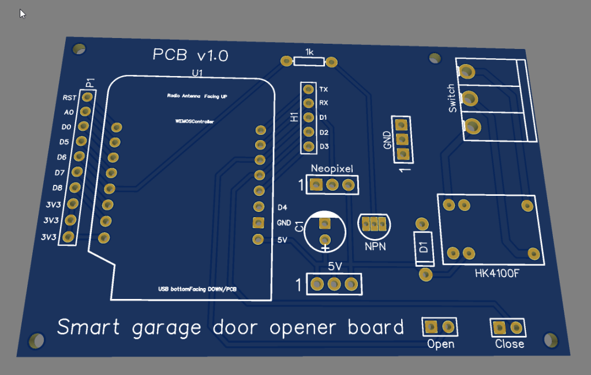
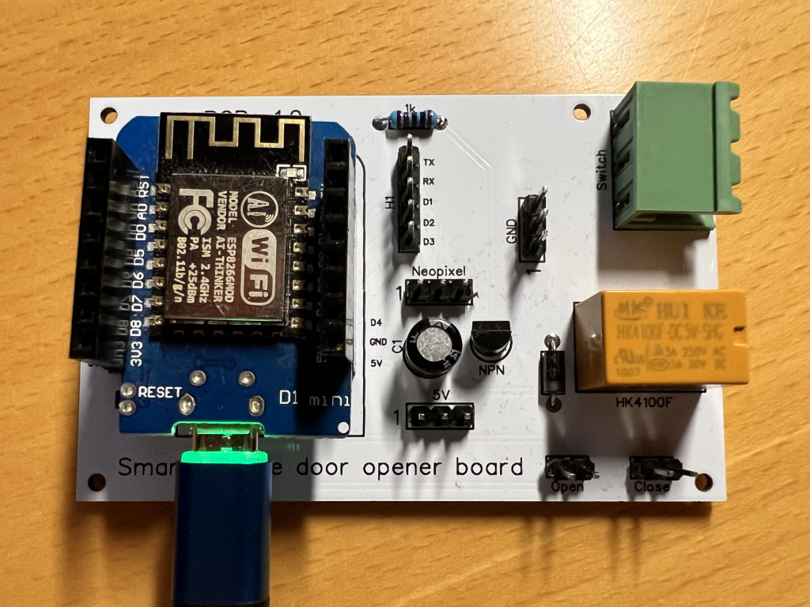
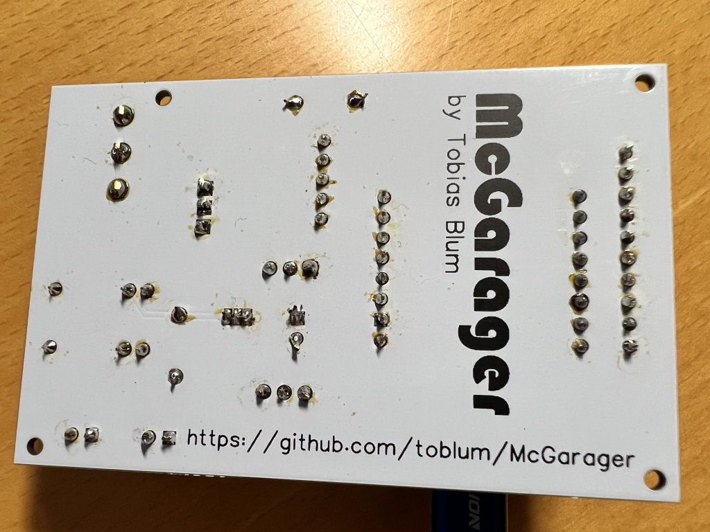
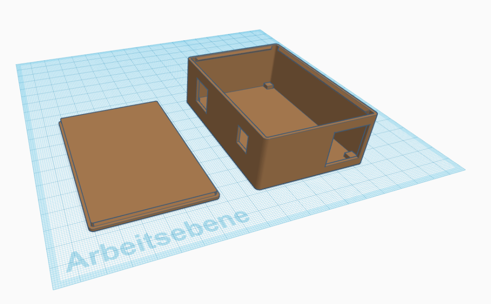

# McGarager v2
Simple MQTT garage door opener with endstop detection (reed sensor)

This is a rewrite of the initial McGarager firmware. It fits to the McGarager PCB.

It uses:
- The [prampec/IotWebConf@^3.2.1](https://github.com/prampec/IotWebConf) framework for easy setup, captive portal, config UI and OTA firmware upload.
- [knolleary/PubSubClient@^2.8](https://github.com/knolleary/pubsubclien) for MQTT communication
- [yiannisbourkelis/Uptime Librar@^1.0.0](https://github.com/YiannisBourkelis/Uptime-Library) for easy uptime display
- [Platformio](https://platformio.org/) for the build process.

Notes:
- No support for neopixel as of now.

Initial config values:
- AP SSID: McGarager / GaragerMc
- Config-UI credentials: admin / GaragerM
- Base MQTT topic: mc_garager

MQTT topics:
- #Base MQTT topic#/status: McGarager publishes JSON status messages to this topic when open/close inputs have changed of if trigged via command.
- #Base MQTT topic#/cmnd:   
  Topic that receives commands
    - Message "status": Trigger sending of status message.
    - Message "trigger": Make the relay close for 250 ms.

## PCB v1.0

- [Gerber files](assets/PCB/Gerber_PCB.zip)
- [BOM](assets/PCB/BOM_PCB_2022-07-20.csv)
- [Schematic](assets/PCB/Schematic_McGarager_2022-07-20.pdf)
- [Front](assets/PCB/PCB_PCB_2022-07-20_front.pdf)
- [Back](assets/PCB/PCB_PCB_2022-07-20_back.pdf)

Preview:

Front:

Back:

## 3D printed enclosure

- [STL Case](assets/McGarager_enclosure_case.stl)
- [STL Lid](assets/McGarager_enclosure_lid.stl)

